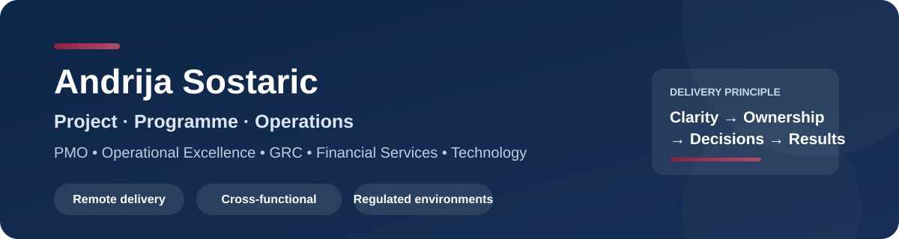

# Andrija Sostaric

**Project, Programme & Operations Manager**  
PMO · Operational Excellence · GRC · Compliance & Risk · Financial Services · Technology

I manage cross-functional projects across technology, SaaS, financial services and regulated environments. My focus is turning complex requirements into clear plans, ownership, governance and measurable delivery.

I have several years of experience working in fully remote, international environments and coordinating distributed teams across functions and locations.

## 60-second recruiter tour

If you only have a minute, start here:

1. **[Live Project Delivery Portfolio](https://andrijasostaric.github.io/andrijasostaric/portfolio/)** — interactive overview of how I approach delivery.
2. **[Programme Command Centre](https://andrijasostaric.github.io/andrijasostaric/portfolio/command-centre.html)** — switch a fictional programme between On Track, Watch and At Risk to see how governance priorities change.
3. **[Operational Excellence: Before → After](https://andrijasostaric.github.io/andrijasostaric/portfolio/before-after.html)** — interactive current-state vs future-state process transformation.
4. **[48-Hour Project Rescue Simulation](./case-studies/48-hour-project-rescue-simulation.md)** — how I restore control when a programme is slipping.
5. **[Executive Decision Memo](./case-studies/executive-decision-memo.md)** — how I turn project detail into a decision-ready one-pager.

## Selected outcomes

| Outcome | Context |
|---|---|
| **~3 months** | ISO 27001 audit-readiness programme delivered in a compressed timeframe |
| **9%** | Operating-cost reduction contribution through centralisation and process improvement |
| **24%** | Average handling-time reduction through process and service-quality improvement |
| **Multi-year remote delivery** | Cross-functional work across international, distributed teams |

## What I work on

- Project and programme delivery
- PMO governance, RAID and dependency management
- Operational excellence and process improvement
- GRC, ISO 27001, SOC 2 and audit readiness
- Operational resilience, incident governance and control ownership
- Financial-services and payments operations
- Third-party and vendor risk coordination
- Executive reporting and stakeholder communication

## Working toolkits

### [PMO Governance Toolkit](https://github.com/andrijasostaric/pmo-governance-toolkit)
A practical demonstration of project governance: charter, RACI, RAID, decision log, reporting cadence and steering-committee structure.

### [Operational Excellence & Automation](https://github.com/andrijasostaric/operational-excellence-automation)
A fictional financial-services case study showing how a manual vendor-onboarding workflow can be redesigned, controlled and automated.

### [GRC Programme Delivery Toolkit](https://github.com/andrijasostaric/grc-program-delivery-toolkit)
A fictional SaaS ISO 27001 readiness programme showing control ownership, evidence tracking, remediation, audit readiness and third-party risk workflow.

## Thinking under pressure

Templates are useful, but project leadership is more visible when the situation is messy:

- **[48-Hour Project Rescue Simulation](./case-studies/48-hour-project-rescue-simulation.md)** — slipping milestones, conflicting views, weak dependencies and ageing decisions.
- **[Executive Decision Memo](./case-studies/executive-decision-memo.md)** — concise recommendation, options, impact and latest-safe decision date.
- **[30–60–90 Day Delivery Plan](./case-studies/30-60-90-day-delivery-plan.md)** — how I approach a new programme without imposing process before understanding the work.
- **[Remote Delivery Operating Model](./case-studies/remote-delivery-operating-model.md)** — written-first coordination, explicit ownership and decision-focused meetings.

## Interactive delivery lab

The live portfolio is deliberately more than a static CV. It includes:

- **Project Health Check** — seven delivery-health factors converted into a live assessment and recommended focus.
- **Programme Command Centre** — milestone confidence, decision ageing, risks, dependencies and governance priorities across three delivery scenarios.
- **Before → After transformation** — a visual operational-excellence case showing how ownership, controls, visibility and automation change.

**[Open the live portfolio →](https://andrijasostaric.github.io/andrijasostaric/portfolio/)**

## Personal projects in progress

These are small products built around interests I genuinely use, rather than portfolio-only exercises:

- **[RemoteBase](https://andrijasostaric.github.io/andrijasostaric/portfolio/remotebase.html)** — weighted comparison of remote-work bases by budget, time zone, climate, transport, connectivity and long-stay fit.
- **[F1 Weekend Planner](https://andrijasostaric.github.io/andrijasostaric/portfolio/f1-weekend-planner.html)** — race-weekend budget, contingency, logistics and readiness planning.
- **[Dive Trip Decision Engine](https://andrijasostaric.github.io/andrijasostaric/portfolio/dive-trip-engine.html)** — preference-based dive-trip ranking for wrecks, marine life, warm water, travel simplicity, value and night diving.

All three are currently **v0.1 prototypes** and are intended to evolve over time.

## Delivery toolkit

**Methods:** Hybrid delivery, Waterfall-style planning, Agile, Kanban  
**Platforms:** Jira, Confluence, MS Project, Notion, Monday.com, Power BI, Power Automate, Microsoft 365, Google Workspace, Slack, Miro  
**GRC / technical collaboration:** Sprinto, Thoropass, UpGuard, Loopio, Ironclad, GitHub, GitLab, Grafana, Wiz, Splunk, incident.io  
**Financial services:** Salesforce, Mambu

## Credentials

- ISO 27001 Lead Implementer
- Agile Project Management with Microsoft Project
- Change Management: Leading Agile Systems Change

## Contact

- [LinkedIn](https://www.linkedin.com/in/asostaric)
- Email: andrija.sostaric@gmail.com
- Sliema, Malta · EU citizen · Open to EU/EMEA remote opportunities

---

*Portfolio integrity: examples in these repositories are synthetic or fictionalised demonstrations created to show my project-management approach. They do not contain confidential information, employer data, client data, audit evidence or proprietary materials.*